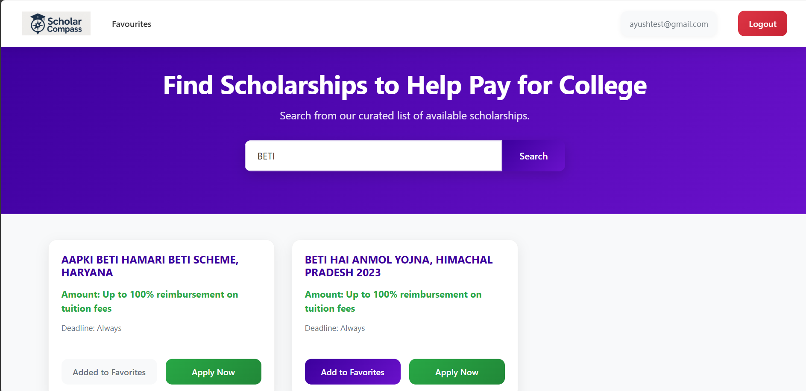

# Scholarship Finder

## Project Overview

**Scholarship Finder** is a web application that aggregates available scholarships in one place, making it easier for students to discover and apply. Users can search, filter, and save scholarships to their favorites, then navigate directly to the provider’s application page.

## Motivation

Researching scholarships across multiple sites is time-consuming and fragmented. Scholarship Finder centralizes listings, displays key details (such as amount and deadline), and streamlines access to the application process, helping students focus on applying rather than searching.

## Key Features

* **Search & Filter**: Quickly find scholarships by name or keyword.
* **User Authentication**: Secure login for students to manage their saved scholarships.
* **Favorites**: Add and remove scholarships to a personalized favorites list.
* **Direct Apply Links**: One-click navigation to the official scholarship application page.

## Tech Stack

* **Frontend**: React, HTML, CSS, JavaScript
* **Backend**: Node.js, Express.js
* **Database**: MongoDB

## Installation & Setup

### Prerequisites

* [Node.js](https://nodejs.org/) (v14 or newer)
* [MongoDB](https://www.mongodb.com/) instance (local or hosted)

### Steps to Run Locally

1. **Clone the repository**

   ```bash
   git clone https://github.com/AyushYadav987/scholarship-finder.git
   cd scholarship-finder
   ```
2. **Install dependencies**

   ```bash
   cd Client
   npm install
   cd Server
   npm install
   ```
3. **Configure environment variables**
   Create a `.env` file in the project root with the following keys:

   ```ini
   PORT=3000
   ```
4. **Start the application**

   ```bash
   npm start
   ```

The app will be available at `http://localhost:5173/home`.

## Usage Guide

1. Open your browser and navigate to `http://localhost:5173/home`.
2. Register a new student account or log in with existing credentials.
3. Use the search bar on the homepage to find scholarships by name or keyword.
4. Click **Add to Favorites** to save any scholarship for later review.
5. Visit the **Favourites** tab to view and manage your saved scholarships.
6. Click **Apply Now** to be redirected to the scholarship provider’s official page.

## Data Sources

* Scholarship listings are **scraped** from publicly available sources.
* Currently, the data is **static** and refreshed manually during updates.

## User Roles

* **Student**: Can browse, search, favorite, and apply to scholarships.
* *(Future)*: Potential admin role for managing scraped data and user support.

## Screenshots

*Add screenshots (or a demo video link) here to showcase the UI and features.*





## Contributions

This project was built by four student developers and is not accepting external contributions at this time.

## License

*No license selected. Add your preferred license here.*

## Authors & Contact

* Aditya Sahu
* Ayush Yadav
* Nimit Maro
* Sujal Maheshwari

For questions or feedback, open an issue on GitHub or contact: **\[[your-email@example.com](mailto:your-email@example.com)]**

---

*Thank you for using Scholarship Finder!*
